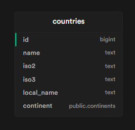

# React Countries app

## Miro Board
https://miro.com/app/board/uXjVPxXtWaE=/?share_link_id=579319722928

## Slices
- first create fetchCountries and console log to make sure we are getting countries

- useEffect function that will correctly load the list of countries when Main component renders

- useEffect uses a try/catch block to display an error if the API call fails ... no idea how I will do this

- useEffect/useState moved into a custom useCountries component 

- users can filter by continent 